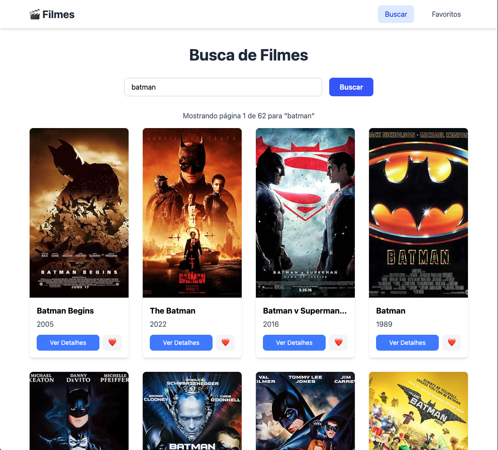
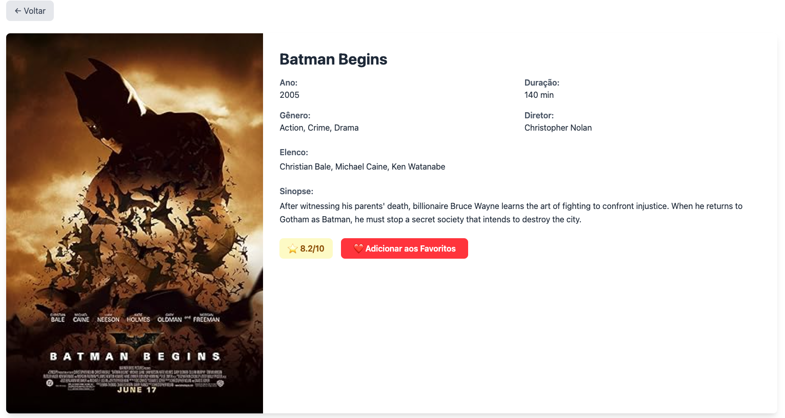
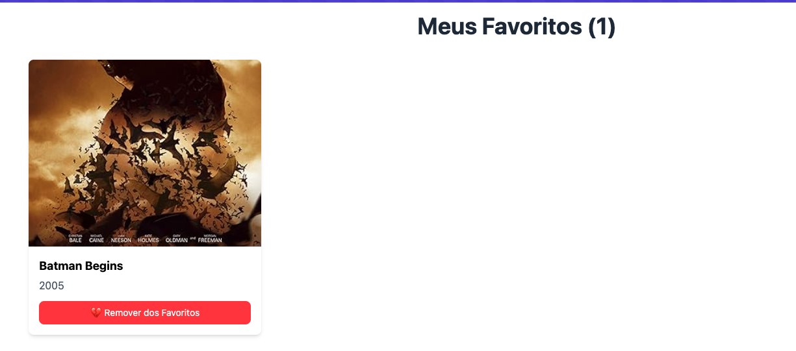
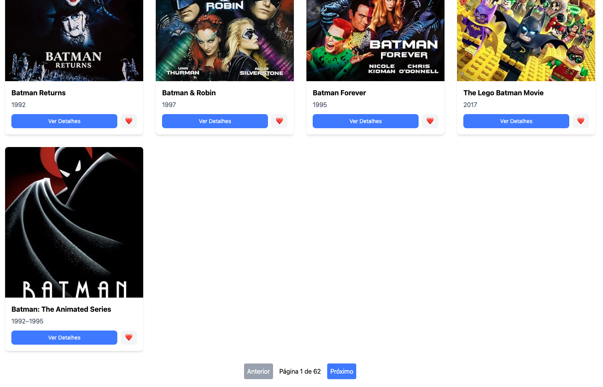

# 🎬 Busca de Filmes OMDB API

Este é um projeto React que permite aos usuários pesquisar filmes utilizando a API OMDB, visualizar detalhes e gerenciar uma lista de favoritos. A aplicação foi desenvolvida com Vite, React e Tailwind CSS.

## ✨ Funcionalidades

-   **Busca de Filmes**: Pesquise filmes por título.
-   **Detalhes do Filme**: Veja informações detalhadas de cada filme, como ano, duração, gênero, diretor, elenco e sinopse.
-   **Lista de Favoritos**: Adicione e remova filmes da sua lista de favoritos.
-   **Paginação**: Navegue pelos resultados da busca.
-   **Persistência de Dados**: Seus filmes favoritos são salvos no `localStorage` do navegador para que você não os perca ao recarregar a página.

## 🚀 Tecnologias Utilizadas

-   **React**
-   **Vite**
-   **Tailwind CSS**
-   **React Router**

## ⚙️ Como Executar o Projeto

1.  **Clone o repositório:**
    ```bash
    git clone [https://github.com/seu-usuario/omdb-api-filmes.git](https://github.com/seu-usuario/omdb-api-filmes.git)
    ```
2.  **Navegue até o diretório do projeto:**
    ```bash
    cd omdb-api-filmes
    ```
3.  **Instale as dependências:**
    ```bash
    npm install
    ```
4.  **Crie um arquivo `.env` na raiz do projeto.** Dentro deste arquivo, adicione sua chave da API da OMDB, como no exemplo abaixo:
    ```
    VITE_API_KEY=sua-chave-aqui
    ```
5.  **Inicie o servidor de desenvolvimento:**
    ```bash
    npm run dev
    ```
6.  Abra seu navegador e acesse `http://localhost:5173/` (ou a porta que aparecer no seu terminal).

## 📂 Estrutura de Pastas

```

omdb-api-filmes/
├── src/
│   ├── components/         # Componentes reutilizáveis
│   │   ├── MovieList.jsx
│   │   ├── NavBar.jsx
│   │   ├── Pagination.jsx
│   │   └── SearchBar.jsx
│   ├── context/            # Contexto da aplicação (Favoritos)
│   │   └── FavoritesContext.jsx
│   ├── pages/              # Páginas da aplicação
│   │   ├── Favorites.jsx
│   │   ├── Home.jsx
│   │   ├── MovieDetails.jsx
│   │   └── SearchPage.jsx
│   ├── App.jsx             # Roteamento principal
│   ├── index.css           # Estilos globais
│   └── main.jsx            # Ponto de entrada da aplicação
├── .gitignore
├── index.html
├── package.json
└── README.md

```
## 📸 Preview

<p align="center">
  
  
  
  
</p>
